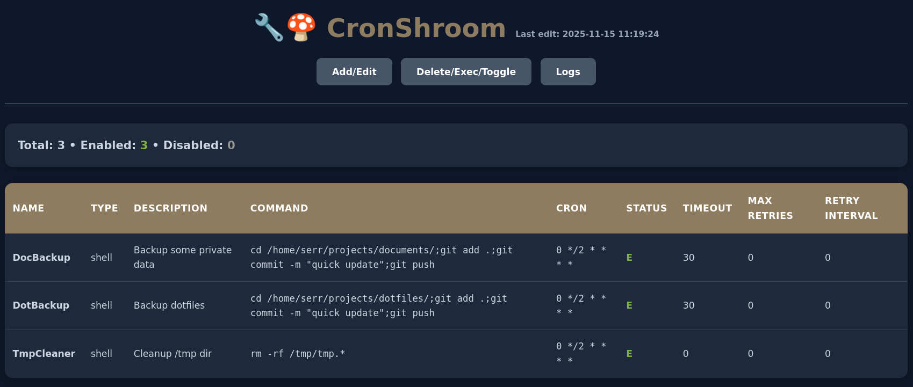
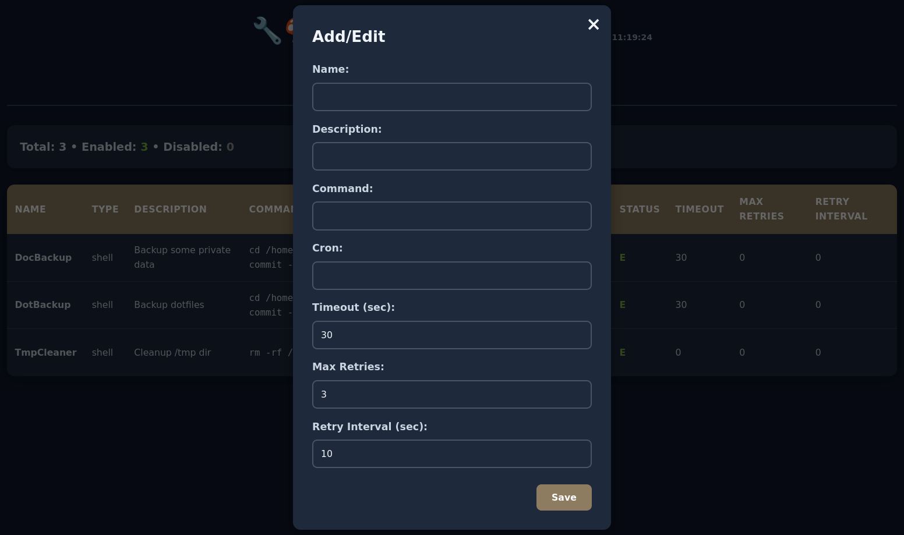
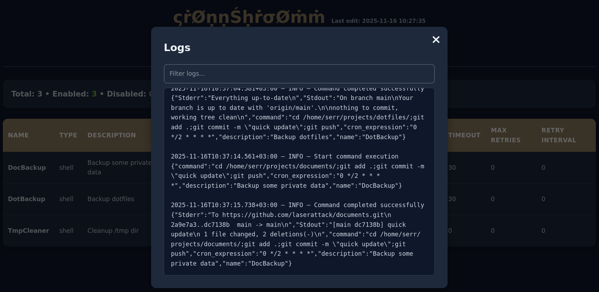
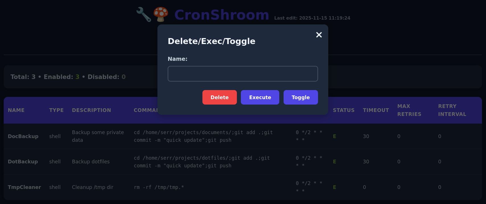

# CronShroom

A simple cron-like shell task runner with a web UI

*mushrooms don't sleep...* 🔧🍄



# Manage

To create a new job or modify an existing one, use the `Add/Edit` button. If you specify the name of an existing job, it will be overwritten; if the name does not exist, a new job will be created

The `Timeout` field specifies the maximum duration the task is allowed to run (if set to 0, no time limit is enforced). If the task exceeds this time, it is terminated. `Max Retries` is the number of times the task will be retried if it fails to complete successfully, and `Retry Interval` is the delay between consecutive retry attempts



Watch logs in real time (`Logs` button). There are three types of logs: `INFO`, `WARN`, `ERROR`

Case-insensitive substring filtering of log records is supported



You can start the task at any time by pressing the button `Execute`

The task can be started or paused at any time by pressing the `Toggle` button. When paused, it will not run until the `Toggle` button is pressed again



# Command line options

Run with flag `-h` to see all available options:

| Option | Description | Default |
|--------|-------------|---------|
| `-d, --database` | Path to the database file | in system config directory |
| `-p, --port` | Web server port | 3777 |
| `--sync-interval` | Database sync interval in seconds | 1 |
| `--max-sync-attempts` | Max consecutive database sync attempts before shutdown | 10 |
| `--server-shutdown-timeout` | The time in seconds that the web server gives all connections to complete before it terminates them harshly | 10 |
| `--mem-stats-interval` | Interval in seconds for logging memory statistics (for leak detection). It also causes garbage collection. Disable - 0 value | 1800 |
| `--http-log` | Log messages about HTTP connections | false |
| `--log-file-max-size` | Log file max size in bytes (if the max size is reached the file will be overwritten) | 10485760 |
| `--cleanup` | Delete all files created by the program in system config directory and shut down | false |

# Cron expression format

| Field Name   | Mandatory | Allowed Values  | Allowed Special Characters |
|--------------|-----------|-----------------|----------------------------|
| Seconds      | YES       | 0-59            | , - * /                    |
| Minutes      | YES       | 0-59            | , - * /                    |
| Hours        | YES       | 0-23            | , - * /                    |
| Day of month | YES       | 1-31            | , - * ? / L W              |
| Month        | YES       | 1-12 or JAN-DEC | , - * /                    |
| Day of week  | YES       | 1-7 or SUN-SAT  | , - * ? / L #              |
| Year         | NO        | empty, 1970-    | , - * /                    |

## Special characters

- `*`: All values in a field (e.g., `*` in minutes = "every minute").
- `?`: No specific value; use when specifying one of two related fields (e.g., "10" in day-of- month, `?` in
  day-of-week).
- `-`: Range of values (e.g., `10-12` in hour = "hours 10, 11, and 12").
- `,`: List of values (e.g., `MON,WED,FRI` in day-of-week = "Monday, Wednesday, Friday").
- `/`: Increments (e.g., `0/15` in seconds = "0, 15, 30, 45"; `1/3` in day-of-month = "every 3 days from the 1st").
- `L`: Last day; meaning varies by field. Ranges or lists are not allowed with `L`.
  - Day-of-month: Last day of the month (e.g, `L-3` is the third to last day of the month).
  - Day-of-week: Last day of the week (7 or SAT) when alone; "last xxx day" when used after
    another value (e.g., `6L` = "last Friday").
- `W`: Nearest weekday in the month to the given day (e.g., `15W` = "nearest weekday to the 15th"). If `1W` on
  Saturday, it fires Monday the 3rd. `W` only applies to a single day, not ranges or lists.
- `#`: Nth weekday of the month (e.g., `6#3` = "third Friday"; `2#1` = "first Monday"). Firing does not occur if
  that nth weekday does not exist in the month.

<sup>1</sup> The `L` and `W` characters can also be combined in the day-of-month field to yield `LW`, which
translates to "last weekday of the month".

<sup>2</sup> The names of months and days of the week are not case-sensitive. MON is the same as mon.

**A good site to understand cron is [cron-checker.com](https://cron-checker.com/)**

# Build using Go compiler

In the repo `src` directory run `go build -o <filename>`

# Build using Docker

In the repo root directory

Build:

```
docker build -t csh-builder .
docker create --name csh-temp csh-builder
docker cp csh-temp:/app/csh <filename>
docker rm csh-temp
```

Clean up the artifacts:

```
docker rmi csh-builder:latest
docker rmi golang:1.25.3
```

# Dependencies

- [github.com/jessevdk/go-flags](https://github.com/jessevdk/go-flags)
- [github.com/reugn/go-quartz](https://github.com/reugn/go-quartz)
- [github.com/bradymholt/cRonstrue](https://github.com/bradymholt/cRonstrue)
